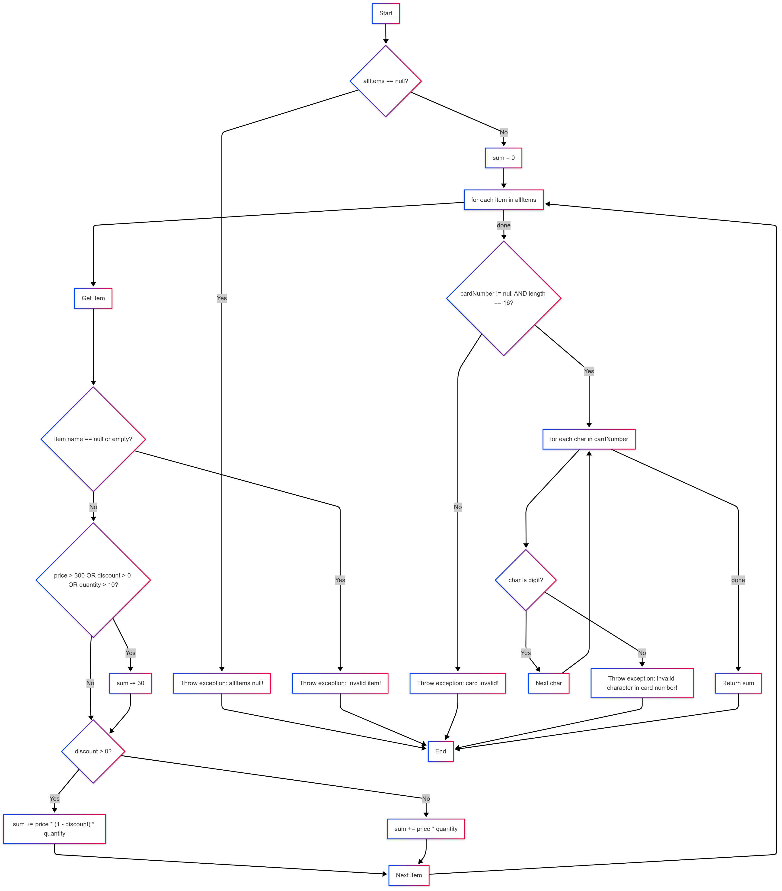

# Втора лабораториска вежба по Софтверско инженерство

## Stefan Damjanov, 233141

## Control Flow Graph

# Цикломатска комплексност:
   M = E - N + 2P (добив 9)
   Цикломатската комплексност од 9 значи дека:
   Во функцијата checkCart има вкупно 8 услови, кои генерираат различни гранки во Control Flow Graph. За секој таков услов постои најмалку една алтернативна патека. 
   Ова значи дека постојат 9 независни логички патеки низ функцијата. За да се обезбеди целосна покриеност при тестирање, потребно е да се дизајнираат најмалку 9 тест случаи, секој од нив покривајќи различна патека.

# Тест случаи според критериумот Every statement

## За да се постигне целосна покриеност според Every Statement критериумот, доволни се 6 тест случаи.
 ### Тест 1: allItems == null
   Со ова го покриваме првиот if (allItems == null) + throw
   Влез:
   allItems = null
   cardNumber = "1234567890123456"
   Очекуван резултат:
   RuntimeException("allItems list can't be null!")

### Тест 2: Item со null име
   Со ова покриваме item.getName() == null + throw
   Влез:
   allItems = [new Item(null, 1, 100, 0)]
   cardNumber = "1234567890123456"
   Очекуван резултат:
   RuntimeException("Invalid item!")

 ### Тест 3: Item со празно име ("")
   Со ова покриваме item.getName().length() == 0
   Влез:
   allItems = [new Item("", 1, 100, 0)]
   cardNumber = "1234567890123456"
   Очекуван резултат:
   RuntimeException("Invalid item!")
   
   ### Тест 4: Item со цена > 300, важечки попуст
   Ова покрива if (item.getPrice() > 300..) ➜ true, if (item.getDiscount() > 0) ➜ true, sum += item.getPrice()*(1-item.getDiscount())*item.getQuantity();, проверка на cardNumber дали е валидна
   Влез:
   allItems = [new Item("item1", 1, 400, 0.1)]
   cardNumber = "1234567890123456"
   Очекуван резултат:
   sum = -30 + 400 * (1 - 0.1) * 1 = -30 + 360 = 330.0
   
   ### Тест 5: Item без попуст, quantity > 10
   Ова покрива item.getDiscount() == 0, item.getQuantity() > 10 ➜ true
   Влез:
   allItems = [new Item("item2", 11, 10, 0)]
   cardNumber = "1234567890123456"
   Очекуван резултат:
   sum = -30 + 10 * 11 = 80.0
   
   ### Тест 6: Card number со невалиден карактер
   Ова го покрива циклусот (char c : cardNumber) и услов allowed.indexOf(c) == -1
   Влез:
   allItems = [new Item("item3", 1, 100, 0)]
   cardNumber = "1234abcd90123456"
   Очекуван резултат:
   RuntimeException("Invalid character in card number!")

   # Тест случаи според критериумот Every path

## Минимален број тест случаи: 8
## Поради тоа што Multiple Condition тестирање бара сите можни комбинации на A, B и C, а бидејќи има 3 услови, тоа се 2^3 = 8 комбинации.

### Тест 1 – A=F, B=F, C=F
   new Item("item1", 1, 100, 0.0) // price=100, discount=0, quantity=1
   (Ниту еден услов не е исполнет. if не се извршува.)

### Тест 2 – A=F, B=F, C=T
   new Item("item2", 11, 100, 0.0) // quantity=11
   (quantity > 10 ➜ if се извршува.)
   
### Тест 3 – A=F, B=T, C=F
   new Item("item3", 1, 100, 0.1) // discount=10%
   (discount > 0 ➜ if се извршува.)
   
### Тест 4 – A=F, B=T, C=T
   new Item("item4", 11, 100, 0.2)
   (B и C се вистинити ➜ if се извршува.)
   
 ### Тест 5 – A=T, B=F, C=F
   new Item("item5", 1, 400, 0.0)
   (price > 300 ➜ if се извршува.)
   
 ### Тест 6 – A=T, B=F, C=T
   new Item("item6", 11, 400, 0.0)
   (A и C се вистинити ➜ if се извршува.)
   
 ### Тест 7 – A=T, B=T, C=F
   new Item("item7", 1, 400, 0.2)
   (A и B се вистинити ➜ if се извршува.)
   
 ### Тест 8 – A=T, B=T, C=T
   new Item("item8", 11, 400, 0.2)
   (Сите се вистинити ➜ if се извршува.)
